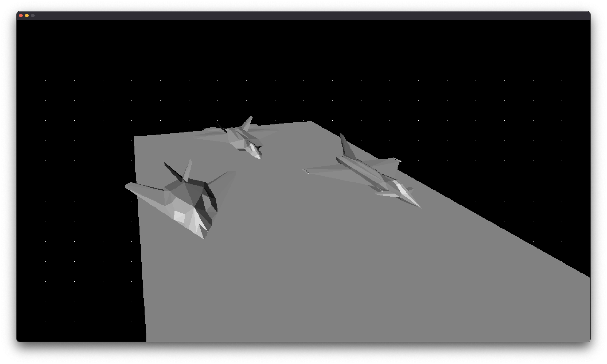
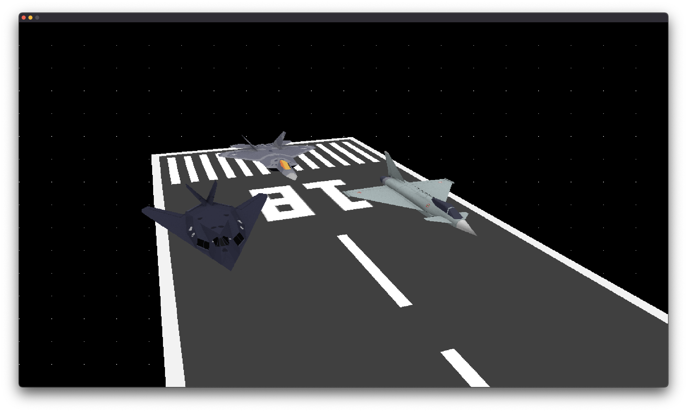

# 3DRenderer

3D CPU-based renderer developed in [3D Graphics Programming from Scratch](https://courses.pikuma.com/courses/learn-computer-graphics-programming) course.

## Techs:
- C
- SDL2
- No 3D libs

## Sega Megadrive (Genesis) version
- https://github.com/nareez/3DRenderer-megadrive

## Screenshots:

### Flat cube

### Pico-8 version

### Wireframe (Culled)

### Flat shaded with ilumination

### Texturized

### Texturized with wireframe

